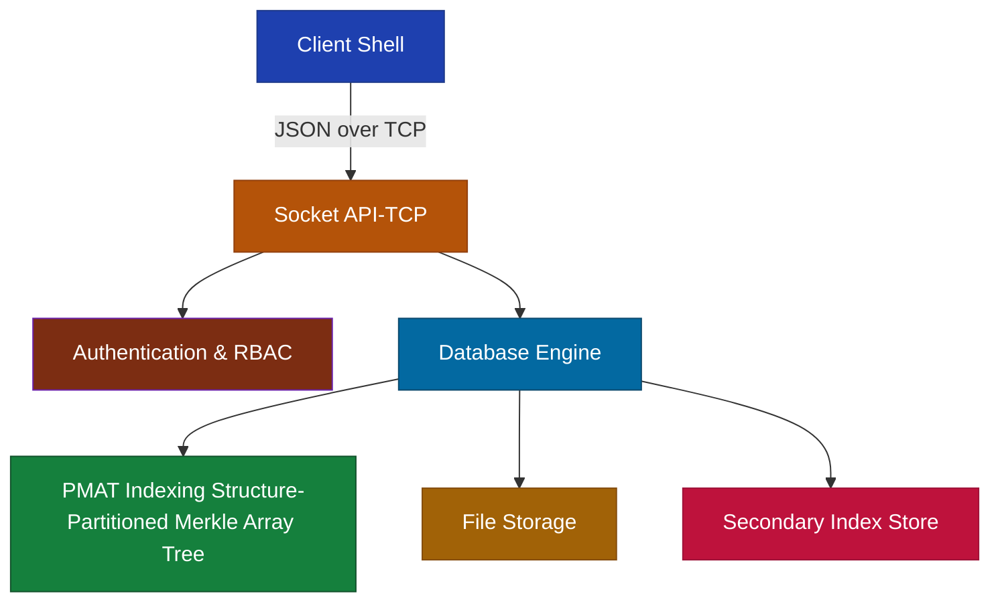

# MerkonDB

A cryptographically secure, Merkle Tree-based key-value database system with role-based access control, secondary index support, and verifiable data integrity.

## Overview

MerkonDB is a modern database system that combines the security of cryptographic proofs with the efficiency of specialized indexing structures. Built around the innovative PMAT (Partitioned Merkle Array Tree) architecture, it provides:

- **Cryptographic Integrity Verification** - Every operation is cryptographically verifiable
- **Role-Based Access Control (RBAC)** - Fine-grained permission management
- **Secondary Indexing** - Fast queries on indexed fields
- **Membership Proofs** - Generate and verify inclusion proofs for any key
- **Interactive CLI Shell** - Color-coded terminal interface for database management
- **Multi-Database Support** - Organize data across multiple named databases and collections

## Architecture



## PMAT (Partitioned Merkle Array Tree)

PMAT is the core data structure powering MerkonDB's performance and security guarantees:

- **Efficient Search**: O(log k) complexity where k = n / partitions
- **Fast Modifications**: O(k) insertion and deletion operations  
- **Integrity Proofs**: Generate compact cryptographic proofs for any operation
- **Distributed Ready**: Verifiable operations across distributed environments

```

## Components

### Client Shell (`client.py`)
- Interactive terminal-based interface built with `cmd.Cmd`
- Handles authentication and TCP communication
- Supports MQL (MerkonDB Query Language) commands
- Manages database/collection switching and user roles
- Provides Merkle proof generation and verification
- Manages secondary index creation and field-based queries

### Server (`server.c`)
- Main command dispatcher and request router
- Handles multiple concurrent client connections
- JSON-based serialization for all communications
- Integrates authentication with database operations
- Handles index creation and query dispatch
- Integrates with the PMAT engine and index storage

### RBAC Module (`rbac.c`)
- User and role management system
- Permission modeling with bitmasks (read, write, create, delete, admin)
- Access control enforcement for all protected operations

### Database Engine (`smt.c` & `smt_db.c`)
- PMAT structure implementation
- Key-value operations (insert, update, delete, find)
- Cryptographic proof generation and root hash computation
- Persistence and bulk operation support
- Key-value and secondary index operations
- Proof generation and integrity verification

## Installation

### Prerequisites
- GCC compiler
- `json-c` library
- `pthread` library  
- Python 3 with `colorama` package

### Build Server
```bash
gcc -o server server.c smt.c smt_db.c rbac.c -ljson-c -lpthread
```

### Install Client Dependencies
```bash
pip3 install colorama
```

## Usage

### Start Server
```bash
./server <localhost> <port>
```

### Connect Client
```bash
python3 client.py <host> <port> <username> <password>
```

## MQL Commands Reference

| Category | Command | Syntax | Description |
|----------|---------|--------|-------------|
| **Database Operations** | List databases | `list databases` | Show all existing databases |
| | Create database | `create database <name>` | Create a new database |
| | Check database exists | `exists database <name>` | Check if database exists |
| | Open database | `open <name>` | Open a database |
| | Close database | `close <name>` | Close a database |
| | Use database | `use <name>` | Set current database context |
| | Get database stats | `stats [database_name]` | Get database statistics |
| | Drop database | `drop database <name>` | Delete a database |
| **Collection Operations** | Create collection | `create collection <name>` | Create a new collection |
| | List collections | `list collections` | Show all collections in current database |
| | Check collection exists | `exists collection <name>` | Check if collection exists |
| | Drop collection | `drop collection <name>` | Delete a collection |
| **Data Operations** | Insert record | `insert <collection> <key> <value>` | Insert key-value pair |
| | Find record | `find <collection> <key>` | Find value by key |
| | Find all records | `find all <collection>` | Retrieve all records in collection |
| | Update record | `update <collection> <key> <new_value>` | Update existing record |
| | Batch insert | `batch insert <collection> key1=value1 key2=value2` | Insert multiple records |
| | Delete record | `delete <collection> <key>` | Delete a record |
| **Indexing** | Create index | `create index <collection> <field>` | Create a secondary index on a field |
| | Find by field | `find by <collection> <field>=<value>` | Query records using indexed fields |
| **Merkle Tree & Proofs** | Generate proof | `generate proof <collection> <key>` | Generate inclusion proof |
| | Get root hash | `root hash <collection>` | Get collection's root hash |
| | Verify proof | `verify proof <collection> <key> <value> <proof>` | Verify inclusion proof |
| | Verify integrity | `verify integrity` | Check database integrity |
| **Persistence** | Save database | `save` | Save current database |
| | Save all | `save all` | Save all databases |
| | Load database | `load <name>` | Load specific database |
| | Load all | `load all` | Load all databases |
| | Compact | `compact` | Optimize storage |
| **User & Role Management** | Add user | `adduser <username> <password>` | Create new user |
| | Create role | `createrole <rolename>` | Create new role |
| | Grant permissions | `grant <role> <permissions>` | Assign permissions to role |
| | Assign role | `assignrole <user> <role>` | Assign role to user |
| **System Commands** | Help | `help` or `?` | Show available commands |
| | Quit | `quit`, `exit`, or `q` | Exit the client |

## Key Features

| Feature | Description |
|---------|-------------|
| **Secondary Indexes** | Fast field-based querying |
| **RBAC** | Fine-grained access control using roles and permissions |
| **Multi-DB Support** | Multiple named databases with collections |
| **Verifiable Storage** | Merkle hashing ensures data integrity |
| **Membership Proofs** | Cryptographic inclusion proofs for any key |
| **Persistence** | Reliable save/load operations to/from disk |
| **Statistics** | Detailed collection and database usage metrics |
| **Compacting** | Storage space optimization |
| **CLI Shell** | Color-coded, user-friendly terminal interface |

## Security Model

MerkonDB implements a multi-layered security approach:

1. **Authentication**: Username/password based session management
2. **Authorization**: Role-based permissions with granular access control
3. **Integrity**: Merkle tree-based cryptographic verification
4. **Auditability**: All operations generate verifiable proofs
5. **Index Integrity**: Verified consistency of secondary indexes

## Performance Characteristics

- **Search Complexity**: O(log k) where k = keys per partition
- **Insert/Delete**: O(k) complexity for modifications
- **Field Query**: Fast lookup via index (O(1) or O(log n) depending on implementation)
- **Proof Generation**: Compact proofs with minimal overhead
- **Memory Efficiency**: Partitioned structure reduces memory pressure

---

For more details, see the in-code documentation and the interactive help (`help` command) in the client shell.